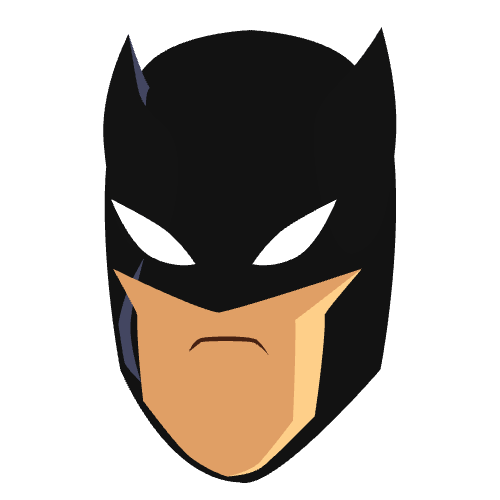

# 🦇🦇 BatTheme

<p align="center">
  <a href="https://github.com/mastersam07/smarty" target="_blank">
    
  </a>
</p>

[](https://github.com/Mastersam07/smarty/actions/workflows/ci.yaml)
[](https://codecov.io/github/Mastersam07/smarty)

A repo showcasing how to work with theme extensions in flutter. For the code guide to the writeup <a href="https://github.com/mastersam07">Dressing your flutter widget with theme extension</a> and also the talk <a href="https://docs.google.com/presentation/d/1FWXvKfj6RJoSvFbdGjpX1EkOZi8zscnPwokh8R8Q3Us/edit?usp=sharing">Dressing your flutter widget with theme extension</a> you could check <a href="https://github.com/mastersam07/bat_theme">here</a>.


This library is an implementation of the design system available here: https://www.figma.com/file/igCMUoRobPORn168iE513B/Smart-hom-app?node-id=505-406

Star⭐ the repo if you like what you see😉.

## Getting Started

* Add the package to your `pubspec.yaml` file:

```yaml
dependencies:
    bat_theme: any
```

* Use the `BatCave` widget:

```dart
import 'package:bat_theme/bat_theme.dart';

class MyApp extends StatelessWidget {
  const MyApp({Key? key}) : super(key: key);

  @override
  Widget build(BuildContext context) {
    return BatCave(
        home: Homepage(),
    );
  }
}
```

Or you can also use the `BatThemeData` extension:

```dart
class MyApp extends StatelessWidget {
  const MyApp({Key? key}) : super(key: key);

  @override
  Widget build(BuildContext context) {
    return MaterialApp(
        theme: BatThemeData(colors: BatColors.light()),
        home: Homepage(),
    );
  }
}
```

## Full Usage

You can check the [example](./example) to see this theming system in usage.

## Roadmap

Who knows whats next? 

- [ ] 
- [ ] 
- [ ] 

## Contributors

[](https://mastersam.tech)
#### **Samuel Abada**
<p>
<a href="https://twitter.com/mastersam_"></a>
<a href="https://linkedin.com/in/abada-samuel/"></a>
<a href="https://medium.com/@sammytech"></a>
<a href="https://facebook.com/abada.samueloghenero"></a>
</p>