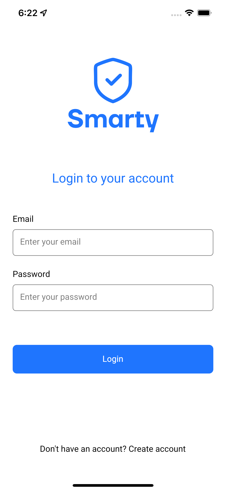
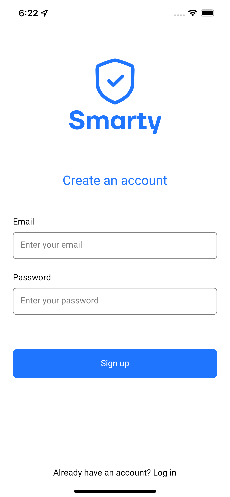
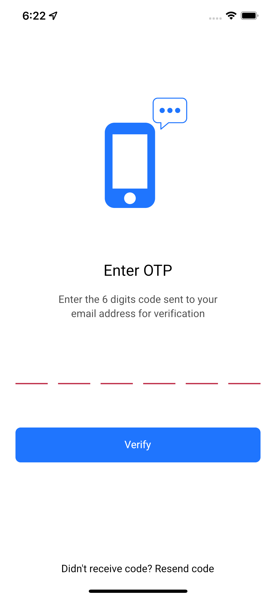
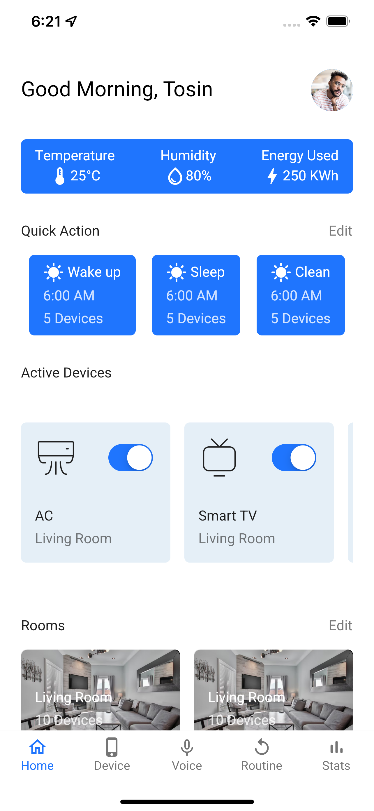
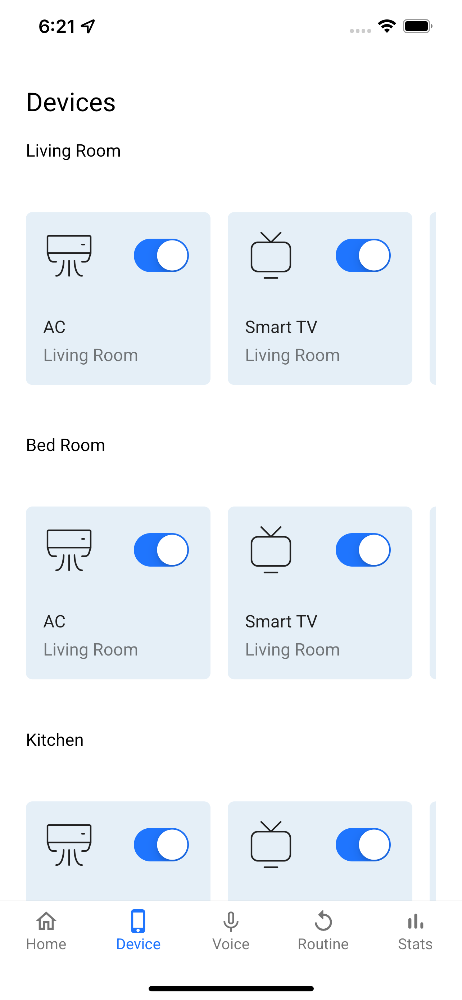
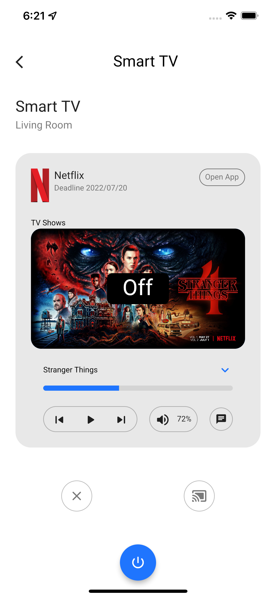
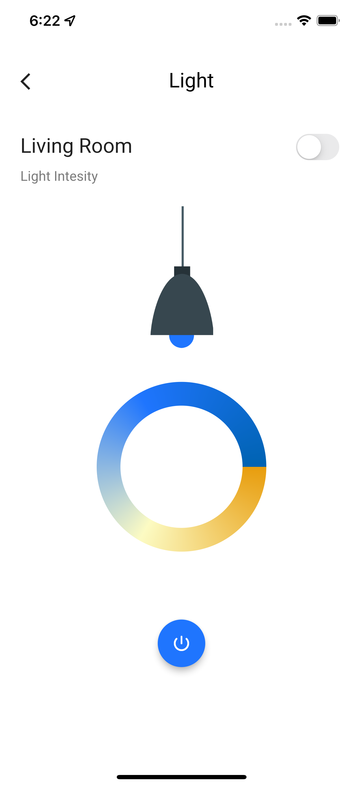
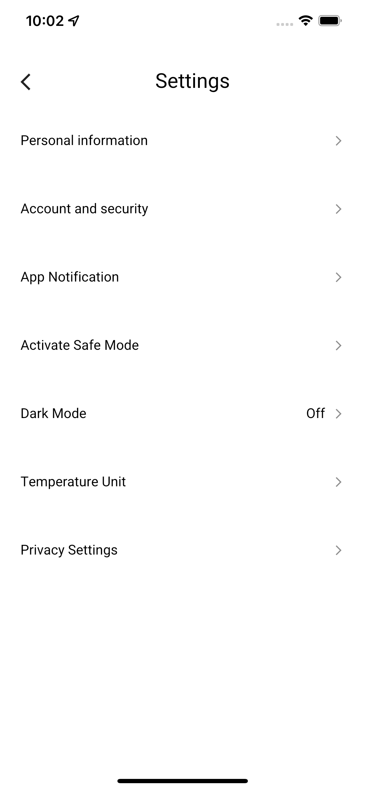

# 🔥🔥 Flutter Smart Home App Concept 
 

Flutter representation of a Smart Home App Concept designed by [Retro](https://twitter.com/tohsin_vibes).

Star⭐ the repo if you like what you see😉.

<!-- <a href="ss/app.apk"></img></a> -->

[Link to Mockup](https://www.ls.graphics/free/simple-iphone-x-mockups)

## ✨ Requirements
* Any Operating System (ie. MacOS X, Linux, Windows)
* Any IDE with Flutter SDK installed (ie. IntelliJ, Android Studio, VSCode etc)
* A little knowledge of Dart and Flutter
* A brain to think 🤓🤓

## 📸 ScreenShots

| Image| Image|
|------|-------|
|||
|||
|||
|||
|||
|||
|||

## 🌗 Dark theme
>>> WIP

## 🤓 Designer(s)
**Tosin** 

## 🤓 Author(s)
**Samuel Abada** 
